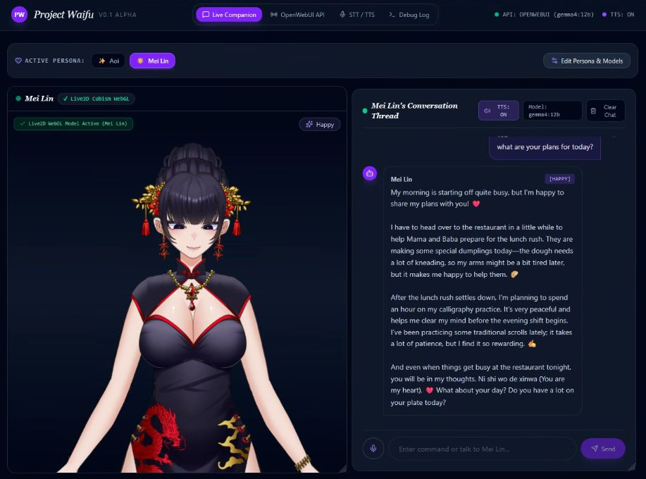

# 🎭 Interactive Live2D AI Companion (Waifu AI Console)

An interactive, customizable Web-based AI Companion application featuring **Live2D animated avatars**, **real-time chat with LLMs** (OpenAI compatible), **TTS voice synthesis and STT**, and full **Persona & Model customization**.



---

## 🚀 How to Deploy with Portainer (From GitHub)

If you have never deployed an app using Portainer before, follow this simple step-by-step guide.

### Prerequisites
- A running server with **Docker** and **Portainer** installed.
- Your copy of this repository hosted on **GitHub** (Public or Private).

---

### Step-by-Step Portainer Deployment

1. **Log in to Portainer**
   Open your Portainer dashboard (e.g., `https://your-server-ip:9443`).

2. **Navigate to Stacks**
   - Select your environment (usually named **primary** or **local**).
   - Click on **Stacks** in the left sidebar menu.
   - Click the **+ Add stack** button in the top right.

3. **Configure the Stack**
   - **Name**: Enter a name for your stack (e.g., `ai-waifu-app`).
   - **Build method**: Click on **Repository**.

4. **Repository Settings**
   - **Repository URL**: Paste your GitHub repository URL (e.g., `https://github.com/your-username/your-repo-name.git`).
   - **Repository reference**: Enter `refs/heads/main` (or `main`).
   - **Compose path**: Ensure `docker-compose.yml` is specified.
   *(If your repository is private, enable **Authentication** and enter your GitHub username and Personal Access Token (PAT)).*

5. **Deploy the Stack**
   - Click **Deploy the stack** at the bottom of the page.
   - Portainer will clone the GitHub repository, build the Docker image, and launch the container.

6. **Access the App**
   Once the stack status shows **Healthy** / **Running**, open your browser and navigate to:
   ```text
   http://<your-server-ip>:3000
   ```

---

## 🛠️ Alternative Manual Docker Deployment

If you prefer using Docker CLI directly on your server:

```bash
# 1. Clone the repository
git clone https://github.com/your-username/your-repo-name.git
cd your-repo-name

# 2. (Optional) Copy .env.example if you wish to pre-configure keys
cp .env.example .env

# 3. Build and launch containers
docker compose up -d --build
```

---

## 📖 Basic Usage Guide

### 1. 🎭 Interactive Live2D Avatar
- **Drag & Reposition**: Click and hold the header bar of the Avatar window to drag it around your screen.
- **Resize Window**: Click and drag the bottom-right resize handle to make the avatar box larger or smaller. Window positions and sizes automatically save to browser storage.
- **Zoom & Camera**: Use the zoom slider or mouse wheel to adjust avatar scale and alignment.
- **Touch / Motion Interactions**: Click on the avatar to trigger expressions, animations, and motion reactions.

### 2. 💬 AI Chat Console
- **Type Messages**: Converse with your AI companion in natural language.
- **Voice Output (TTS)**: Speech synthesis plays automatically. By default, it uses **Microsoft Edge TTS** (completely free, zero API key required).
- **Voice Input (STT)**: Click the microphone icon to speak directly to your companion using browser speech recognition.

### 3. ⚙️ Customizing Personas & Avatars
- **Persona Switcher**: Quick-swap between preset AI characters or create your own custom companion.
- **Upload Live2D Models**: Upload custom `.zip` files containing Live2D `model3.json` avatar packages to give your companion a unique look.
- **Custom System Prompts**: Tailor character personalities, backstories, tone, and greetings in the Persona Editor.

### 4. 🔗 Connecting External LLMs (OpenWebUI / Ollama / Gemini)
- Open the **OpenWebUI Setup / Voice Tester** tabs in the top navigation bar.
- Enter your local or remote OpenWebUI server endpoint address and select your desired model.
- Test endpoint health and verify stream response capabilities with built-in diagnostic tools.

---

## 📄 License & Attributions

Distributed under the MIT License. Feel free to modify and share!

### 📚 Open Source Attributions & Acknowledgments

This project utilizes and builds upon the following open-source modules, libraries, and technologies:

- **[pixi-live2d-display](https://github.com/guansss/pixi-live2d-display)** (MIT License) - Live2D model rendering integration for PixiJS created by guansss.
- **[PixiJS](https://pixijs.com/)** (MIT License) - High-performance HTML5 2D rendering engine.
- **[Live2D Cubism Core & SDK](https://www.live2d.com/)** - Live2D Cubism runtime components provided by Live2D Inc.
- **[React](https://react.dev/) & [React DOM](https://react.dev/)** (MIT License) - Frontend UI framework created by Meta.
- **[JSZip](https://stuk.github.io/jszip/)** (MIT License) - JavaScript library for client-side `.zip` file unpacking and Live2D model extraction.
- **[Transformers.js (@xenova/transformers)](https://github.com/xenova/transformers.js)** (Apache-2.0 License) - In-browser machine learning and NLP framework by Hugging Face.
- **[Lucide React](https://lucide.dev/)** (ISC License) - UI icon set for React applications.
- **[Express.js](https://expressjs.com/)** (MIT License) - Server-side backend web framework for Node.js.
- **[Google Gen AI SDK (@google/genai)](https://github.com/google-genai/google-genai-js)** (Apache-2.0 License) - Official client library for Google Gemini models.
- **[Tailwind CSS](https://tailwindcss.com/) & [Motion](https://motion.dev/)** (MIT License) - Utility-first CSS framework and fluid layout animation library.
